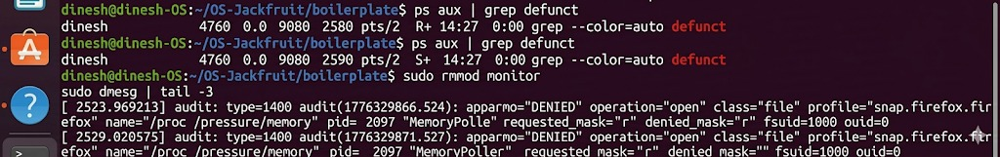
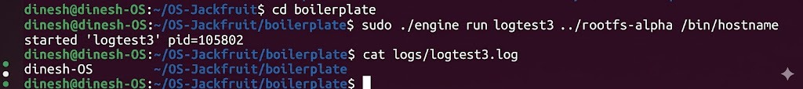

# OS-Jackfruit

Lightweight Container Runtime Simulator

---

## 📌 Overview
This project simulates the basic working of a container runtime.  
It demonstrates how different workloads (CPU, memory, and I/O) can be executed and monitored.

---

## ⚙️ Features
- CPU workload simulation  
- Memory workload simulation  
- I/O workload simulation  
- Logging and monitoring  
- Simple container-like execution  

---

## 📂 Project Structure

OS-Jackfruit/
├── src/  
├── include/  
├── screenshots/  
├── logs/  
├── Makefile  
└── README.md  

---

## 🚀 How to Run

### Compile
make

### Run workloads
./engine cpu  
./engine memory  
./engine io  

---

## 📸 Output Screenshots

### Supervisor Start

### Container Logs (Alpha)

### Container Logs (CPU Low)

### Kernel Monitor Output

### Process Status

### Log Test Output

---

## 🎯 Conclusion
This project demonstrates a basic simulation of container runtime behavior using different workloads and monitoring techniques.

---

## 📚 Technologies Used
- C Programming  
- Linux  
- GCC  
